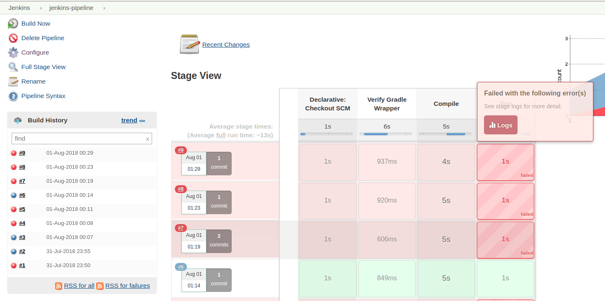
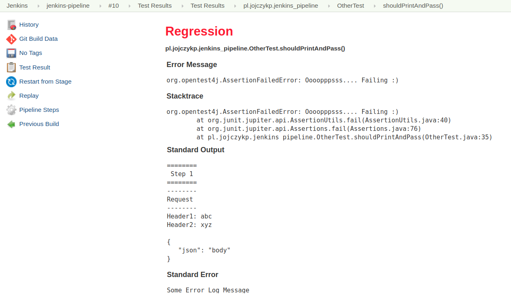

# Sample Jenkins Pipeline with Gradle Wrapper

## Setup Jenkins (docker image)

- Start

  `$ docker run -d -v jenkins_home:/var/jenkins_home -p 8080:8080 -p 50000:50000 jenkins/jenkins:lts`

- Obtain initial password

  `$ docker volume inspect jenkins_home | jq .[0].Mountpoint`

  `"/var/lib/docker/volumes/jenkins_home/_data"`

  `$ sudo cat /var/lib/docker/volumes/jenkins_home/_data/secrets/initialAdminPassword`

  `f6b8526a94ac41c4be65443ffab5ec96`

## Notes

- Task downloading resources (gradle wrapper and dependency jars) may take longer for the
  first time due to large download size. Subsequent executions should be faster.

## Sample Screens

**Pipeline History**
 

**Detailed Failure Report**

**Pipeline Status**

## References

- https://github.com/jenkinsci/docker/blob/master/README.md
- https://github.com/arnaud-deprez/demo-jenkins-pipeline-gradle/blob/master/Jenkinsfile
- https://www.youtube.com/watch?v=s73nhwYBtzE
- https://github.com/jenkinsci/pipeline-model-definition-plugin/wiki/Reporting-test-results-and-storing-artifacts
- https://plugins.jenkins.io/build-monitor-plugin
